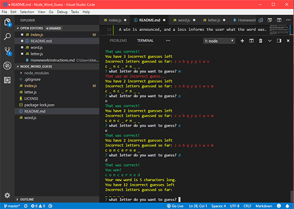

# Node_Word_Guess

## concept

A hangman game using the console.  This is a node app that features an object oriented approach.

## functionality

The user is presented with the length of a random word, and then is asked to guess a letter.  They are given a total of 12 incorrect letter guesses. 

With each guess, the console displays the number of incorrect guesses left, a display of all incorrect guesses so far, as well as the current state of the guess word so far.

The app requires the user to input only one letter at a time, and does not penalize the user if they input previously guessed letters.

A win is announced, and a loss informs the user what the word was.

The game then automatically generates a new word, and the game continues autimatically.

## features
* Recursion in the prompting function
* Modularization
* nested objects

## APIs and node extensions:
* inquirer - for terminal prompting
* chalk - for colorization of the terminal text
* random-words - to generate the words to guess

